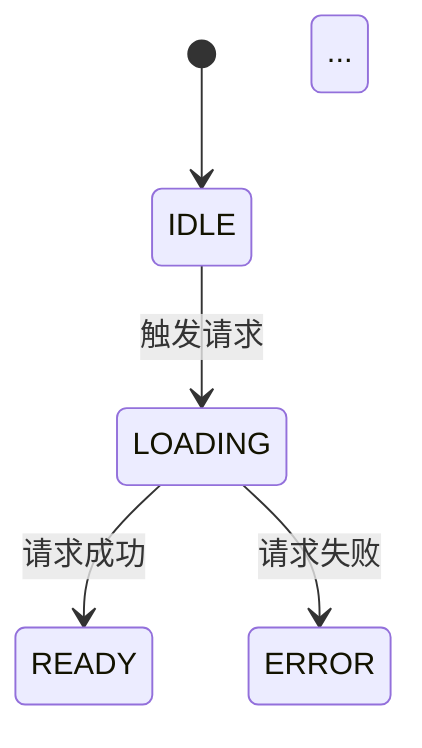
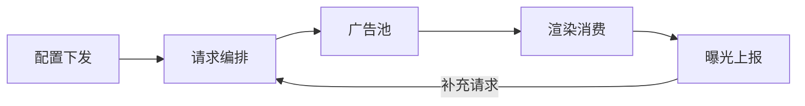

# Output Spec

> 输出一份广告全链路流程说明文档。
> 读者读完后应能准确理解该项目广告系统的完整运转机制。

## 输出文件

- 目录：当前 skill 仓库根目录（安装到 Codex 后对应 `.codex/skills/quickapp-ad-strategy/`）
- 文件：`ads_flow_analysis.md`

## 文档结构（固定 12 章，不可省略）

| 章节 | 标题 | 核心问题 | 可视化要求 |
|------|------|----------|-----------|
| 1 | 分析范围与输入确认 | 分析了什么？ | 无 |
| 2 | 广告配置全貌 | 配置结构和字段含义？ | 配置结构树形图 |
| 3 | 全局初始化流程 | 启动时广告系统做了什么？ | 初始化时序图 |
| 4 | 页面级流程 | 页面的广告参与方式？ | 每页面生命周期流程图(mermaid) |
| 5 | **请求编排**（重点） | 怎么请求、怎么并行、失败怎么办？ | **时序图 + mermaid 流程图**（必须） |
| 6 | 广告池 | 数据怎么存、怎么取？ | 池结构图 + 入池/出池 mermaid 图 |
| 7 | 渲染消费 | 数据到展示的完整路径？ | 各类型渲染路径 mermaid 图 |
| 8 | 曝光上报 | 展示后怎么通知平台？ | 无（文字即可） |
| 9 | 状态机 | 哪些变量控制行为？ | 关键状态转换图(mermaid stateDiagram) |
| 10 | 生命周期 × 广告类型融合视图 | 矩阵全景 | 矩阵表格 |
| 11 | 证据索引 | 关键代码位置 | 无 |
| 12 | 总结 | 业务概述（无 文件:行号） | 全链路概览图(mermaid) |

## 各章节详细要求

### 第 2 章：广告配置全貌

必须回答：
- 有没有集中配置对象？在哪里？完整结构是什么？
- 没有集中配置时，配置散落在哪些位置？重建汇总配置。
- 每个配置字段的含义、默认值、来源。
- 广告位列表：每个位的 ID、类型、关联页面。
- 厂商分支：不同厂商的配置差异。

### 第 5 章：请求编排（必须为最长章节）

**输出结构（强制三段式）**：

**第一段：Mock 数据结构**

从代码中提取字段，构造一份字段名与代码一致的 mock 配置（ggSlots + ggSort）。
必须包含以下内容：
- 主池 mock 配置（ggSlots 广告位列表 + ggSort 调度参数，每个字段标注代码默认值）
- 奖励池 mock 配置
- 闪屏池 mock 配置（如有）
- **并行与错峰参数速查表**（必须输出，格式如下）：

| 参数名 | 主池默认值 | 奖励池默认值 | 含义 |
|---|---|---|---|
| firstReqSize | [值] | [值] | 首轮取位数 |
| requestSize | [值] | [值] | 后续轮取位数 |
| requestDuration | [值]ms | [值]ms | 同一轮内第 i 个请求延迟 = i × requestDuration |
| requestInterval | [值]ms | [值]ms | 两轮之间基础间隔 |
| reqLock 公式 | — | — | requestInterval + (本轮请求数−1) × requestDuration |
| bufferSize | [值] | [值] | cachePool 达此值后暂停请求 |
| errBreakCount | [值] | — | 错误熔断阈值 |
| poolFailBreakCount | [值] | — | 撞池熔断阈值 |

**第二段：Mock Walkthrough（逐轮逐请求）**

用 mock 配置走完多轮请求过程，不带 文件:行号。
每个请求必须标注：广告位 ID、广告源(source)、广告类型(slotType)、发起时刻。
每轮必须标注：取了几个位、锁窗计算过程、解锁时刻、入池后库存变化。
必须覆盖：
- 主池时序（首轮 → 响应与入池明细 → 锁窗 → 第 2 轮 → 终止条件）
- 奖励池时序
- Banner 时序（如有）
- 闪屏池时序（如有）

请求流程 mermaid 图（必须作为独立 ```mermaid 代码块输出）。

**第三段：代码映射（集中列出证据）**

在 walkthrough 之后，按以下分组集中给出 文件:行号 证据：
1. 触发入口调用链
2. 守卫条件代码位置
3. getNextCodes 选位逻辑
4. 错峰/setTimeout 实现
5. reqLock 计算
6. generateDSI / 广告源分发
7. intoPool 入池判定
8. countErr / errBreak 熔断
9. innerBid 竞价裁剪（如有）

### 第 6 章：广告池

**可视化要求**：
- 池结构图（用表格或树形结构展示池的组织方式）
- 入池/出池 mermaid 流程图

必须回答：
- 池变量名称、位置、数据结构、组织维度
- 入池时机、条件（过滤/去重/容量）、方式
- 出池时机、方式（FIFO/LIFO/按条件）、取后是否删除
- 淘汰策略
- 池与请求的联动
- 无显式池时的数据暂存方式

### 第 7 章：渲染消费

**可视化要求**：各广告类型的渲染路径 mermaid 图

必须回答：
- 渲染入口函数
- 渲染前校验条件
- 每种广告类型的完整渲染路径
- 展示后的后续动作
- 销毁时机

### 第 9 章：状态机

**可视化要求**：关键状态位的状态转换图

格式：


### 第 10 章：融合视图

矩阵表格必须包含：

```
| 生命周期/事件      | Banner      | 插屏        | 激励视频     | 原生/2.0     |
|--------------------|-------------|-------------|-------------|-------------|
| app onCreate       | ...         | ...         | ...         | ...         |
| page onShow        | ...         | ...         | ...         | ...         |
| page onReady       | ...         | ...         | ...         | ...         |
| page onHide        | ...         | ...         | ...         | ...         |
| page onDestroy     | ...         | ...         | ...         | ...         |
| 定时器触发          | ...         | ...         | ...         | ...         |
| 用户交互            | ...         | ...         | ...         | ...         |
| 广告关闭(onClose)   | ...         | ...         | ...         | ...         |
```

### 第 12 章：总结

**可视化要求**：一个覆盖全链路的概览 mermaid 图



在概览图下方用业务语言概述广告系统全貌（禁止 文件:行号）。

## 写作约束

### 风格

1. **措辞严谨**：使用精确的业务和技术语言
2. **配置融入说明**：在讲流程时自然带出配置字段及其值
3. **先主干后分支**：每个环节先讲正常流程，再讲异常/降级
4. **数据流向明确**：每一步说清"数据从哪来、经过什么处理、去了哪里"
5. **关键变量首次出现时说明其职责**
6. **可视化优先**：能用图表说明的环节，先给图再做文字补充

### 证据约束

1. 第 2~11 章允许附带 `文件:行号`；第 12 章禁止
2. 每个核心结论至少一个代码证据锚点
3. 调用链格式：`a.js:10 → b.js:25 → c.js:50`
4. **证据后置**：对于流程较长的章节（特别是第 5 章请求编排），
   先把完整流程和机制讲清楚（这部分可不带证据），
   然后在章节末尾集中按模块分组列出代码证据。
   短章节仍可在行内附证据。

### mermaid 输出

1. mermaid 图必须作为独立的 ` ```mermaid ` 代码块输出
2. 不可嵌套在其他代码块（如 ```text）内部，否则不会渲染
3. 每个 mermaid 块前后必须有空行

### 禁止事项

1. 禁止输出治理/优化/重构/回滚建议
2. 禁止打分或评级
3. 禁止只列 API 不讲流程
4. 禁止脱离代码事实做推测
